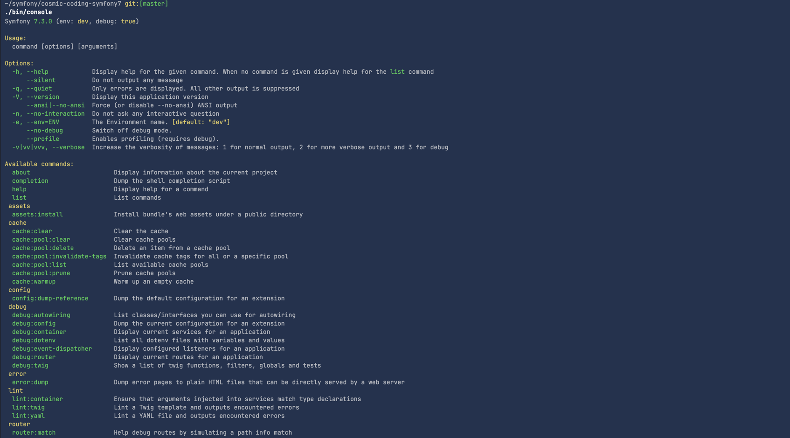
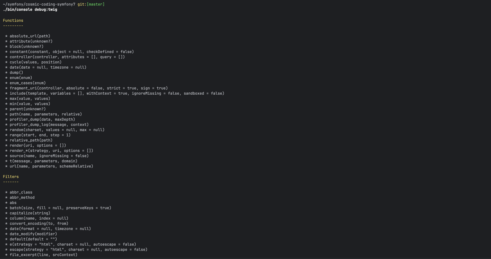

# Debugging with the Amazing Profiler

Symfony boasts some of the most *epic* debugging tools of all the Internet. But because
Symfony apps start so small, we don't even have them installed yet. Time
to fix that. Head over to your terminal and, like before, commit all of your
changes so we can check out what the recipes will do. I already did that.

## Installing the Debugging Tools

Then run:

```terminal
composer require debug
```


Yup! That's another Flex alias. *And*... it installs a *pack*. This installs
four different packages that add a variety of debugging goodness to our project.
Spin over and open `composer.json`.

[[[ code('3921cfe932') ]]]

Ok, the pack added one new line under the `require` key for `monolog-bundle`.
Monolog is a logging library.

Then all the way at the bottom, it added three packages to a `require-dev` section.

[[[ code('23fb5876dc') ]]]

These are known as *dev* dependencies... which means they won't be downloaded when
you deploy to production. But otherwise, they work the same as packages under
the `require` key. All three of these help power something called the *profiler*.
We'll see that in *just* a minute.

Before we do, go back to your terminal and run

```terminal
git status
```

so we can see what the recipes did. Ok: it updated the normal files, enabled
a few new bundles and gave us three new configuration files *for* those bundles.

What's the end result of all this new stuff? Well, first, we now have a logging
library. So, like magic, logs will start popping into a `var/log/` directory.

## Hello Web Debug Toolbar & Profiler

But the *mind-blowing* moment happens when we refresh the page. Woh! A
beautiful new black bar at the bottom called the web debug toolbar.

This is *bursting* with info. Over here, we can see the route and *controller* for
this page. That it makes it easy to go to *any* page on your site - maybe one you
didn't even build - and quickly find the code behind it. We can also see how long
this page took the load, how much memory it used, and even the twig template that
was rendered and how long *that* took.

But the *real* magic of the web debug toolbar happens when you click any of these
links: you hop into the *profiler*. This has ten *times* more info: details about
the request and response, logs that occurred while loading that page, routing
details, and even stats about which Twig templates were rendered. Apparently
*six* templates were rendering: our main one, the base layout and a few others
that power the web debug toolbar, which, by the way, won't be rendered or shown
when we deploy to production. But we'll talk about that in the next tutorial.

Then there's probably my favorite section: Performance. This slices our entire
page load time into different pieces. I love this. As you learn more about
Symfony, you'll get more familiar with what these different pieces *are*. This
section is useful for knowing which part of your code might be slowing down the page...
but it's also a fantastic way to dive deeper into Symfony and understand all its
moving pieces.

We're going to use the profiler throughout this series, but let's turn to
another debugging tool: one that's been installed in our app this whole time!

## Hello bin/console!

Head over to the command line and run:

```terminal
php bin/console
```


Or, on most machines, you can just say `./bin/console`. This is Symfony's console,
and it's *packed* with commands that can do all sorts of stuff! We'll learn about
them along the way. You can also add your *own* commands, which we'll do at the end
of the tutorial.

Notice that a bunch of these start with `debug` - like `debug:router`. Try that:

```terminal
php bin/console debug:router
```


Cool! This shows us *every* route in our app: the homepage route at the bottom
and a bunch of routes added by Symfony in the `dev` environment that power the
web debug toolbar and profiler.

Another command is `debug:twig`:

```terminal-silent
php bin/console debug:twig
```


This tells us every Twig function, filter or other thing that exists in our app.
This is *like* the Twig docs... except it also includes *extra* functions and filters
that are *added* to Twig by bundles that we have installed. Pretty cool.

These `debug` commands are *super* useful, and we'll keep trying more of them
along the way.

Next, let's create our first API endpoint and learn about Symfony's powerful
serializer component.
