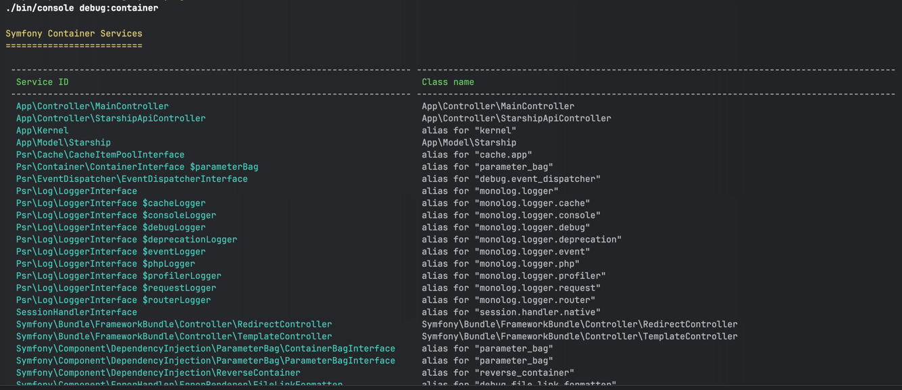
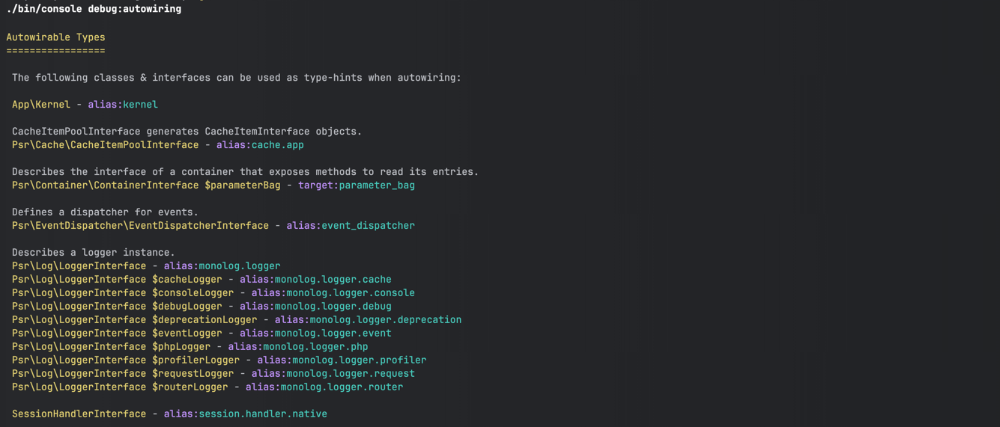

# Services: The Backbone of Everything

Let's talk about services. These are *the* most important concept in Symfony. And
once you understand them, honestly, you'll be able to do *anything*.

## What is a Service?

First, a service is an object that does work. That's it. For example, if you instantiated
a `Logger` object that has a `log()` method, that's a service! It does work: it
logs things! Or if you created a database connection object that makes queries
to the database then... yup! That's a service too.

So then... if a service is just an object that does work... what lazy objects
*aren't* services? Our `Starship` class is a perfect example of a *non* service.
It's main job is *not* to do work: it's to hold data. Sure, it has a few public
methods... and you could even put some logic inside of these methods to do something.
But ultimately, it's not a worker, it's a data holder.

What about controller classes? Yeah, they're services too. Their work is to
create response objects.

Anyway, *every* bit of work that's done in Symfony is actually done by a service.
Writing log messages to this file? Yeah, there's a service for that. Figuring out
which route matches the current URL? That's the `router` service! What about rendering
a twig template? Yep, it turns out that the `render()` method is a shortcut
to find the correct service object and call a method on it.

## The Container & debug:container

You may sometimes also hear that these services are organized into a big object called
the "service container". You can think of the container like a giant associative
array of service objects, each with a unique id. Want to see a list of every service
in our app right now? Me too!

Find your terminal and run:

```terminal
bin/console debug:container
```


That's a lot of services! Let me make this smaller so each fits on its own
line... better.

On the left side, we see the *ID* of each service. And on the right, the *class*
of the object that the ID corresponds to. Cool, right?

Go back to our controller and hold control or command to open up the `json()` method
again. Now this makes more sense! It's checking to see if the container has a service
whose ID is `serializer`. If it does, it grabs that service from the container and
calls the `serialize()` method on it.

When *we* work with services, it won't look exactly like this. But the super important
thing is that we now understand what's going on.

## Bundles Provide Services

My next question is: where do these services come from? Like, who says there's a
service whose ID is `twig`... and that when we ask the container for it, it should
return a twig `Environment` object? The answer is: *entirely* from bundles. In fact,
that's the main point of installing a new bundle. Bundles give us services.

Remember when we installed `twig`? It added a bundle to our
app. And guess what that bundle did? Yup: it gave us new services, including the
`twig` service. Bundles give us services... and services are *tools*.

## Autowiring

And though there are *many* services in this list, the vast majority of these are
low-level service objects that we won't ever use or care about. We also won't
care about the ID of the services most of the time.

Instead, run a related command called:

```terminal
php bin/console debug:autowiring
```


This shows us all the services that are autowireable, which is the technique
that we'll use to fetch services. It's basically a curated
list of the services that we're most likely to need.

## Autowiring the Logger Service

So let's do a challenge: let's log something from our controller. Here's a sneak
peek into how I approach this problem in my brain:

> Ok, I need to log something!
> And... logging is work.
> And... services do work!
> Thus, there must be a logger service that I can use!
> Quod erat demonstrandum!

Forgive me latin nerds. The point is: if we want to log something, we just need to
find the service that *does* that work. Okay! Rerun the command but search for log:

```terminal-silent
php bin/console debug:autowiring log
```


Boom! It found about 10 services, all starting with `Psr\Log\LoggerInterface`.
We're going to talk about what these *other* services are in the next tutorial. For
now, focus on the main one. This tells me is that there *is* a service in the
container for a logger. And to get it, we can autowire it using this interface.

What does that mean? In the controller method where we want the logger, add an
argument type-hinted with `LoggerInterface` - hit tab - then say `$logger`.

[[[ code('6b3f42abe8') ]]]

In this case, the *name* of the argument isn't important: it could be anything.
What matters is that the `LoggerInterface` - that corresponds to this `use` statement -
matches the `Psr\Log\LoggerInterface` from `debug:autowiring`.

It's that simple! Symfony will see this type-hint and say:

> Oh! Since that type-hint matches the autowiring type for this service, they must
> want me to *pass* them that service object.

I don't know why Symfony sounds like a frog in my head. Anyway, let's see if
this works. Add `dd($logger)`: `dd()` stands for "dump and die" and comes from
Symfony.

[[[ code('7f28368d2c') ]]]

Refresh! Yes! It printed the object beautifully then stopped execution. It's
*working*! Symfony passes us a `Monolog\Logger` object, which implements that
`LoggerInterface`.

The trick we just did - called autowiring - works in exactly two places: our controller
methods and the `__construct()` method of any service. We'll see that second
situation in the next chapter.

## Controlling how Services Behave

And if you're wondering where this `Logger` service came from in the first place...
we already know the answer! From a bundle. In this case, `MonologBundle`.
And... how could we *configure* that service... to, I don't know, log
to a different file? The answer is: `config/packages/monolog.yaml`.

This config - including this line - configures `MonologBundle`... which really
means that it configures how the *services* work that MonologBundle give us. We'll
learn about this percent syntax in the next tutorial, but this tells the `Logger`
service to log to this `dev.log` file.

## Using the Logger

Ok, now that we have the `Logger` service, let's use it! How? Well, *of course*,
you can read the docs. But thanks to the type-hint, our editor will help us!
`LoggerInterface` has a *bunch* of methods. Let's use `->info()` and say:

[[[ code('d3a5032330') ]]]

> Starship collection retrieved.

Try it out: refresh. The page worked... but did it log anything? We could go check
the `dev.log` file. *Or*, we can use the Log section of the profiler for
this request.

## Seeing the Profiler for an API Request

But... wait! This is an API request... so we don't have that cool web debug toolbar on the
bottom! That's true... but Symfony *did* still collect all that info! To get to
the profiler for this request, change the URL to `/_profiler`. This lists
the most recent requests to our app, with the newest on top. See this one?
That's our API request from a minute ago! If you click this token... boom!
We're looking at the profiler for that API call in all its glory... including
a Log section... with our message.

Ok, now that we've seen how to *use* a service, let's create our *own* service next!
We're unstoppable!
